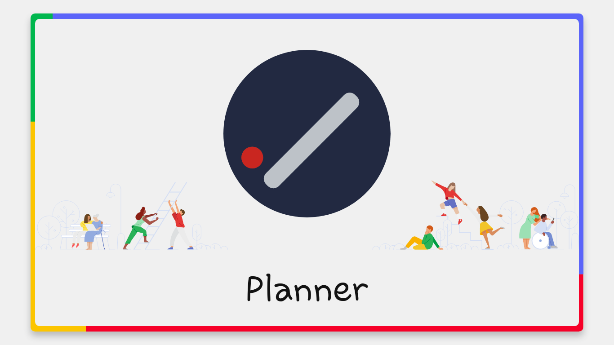
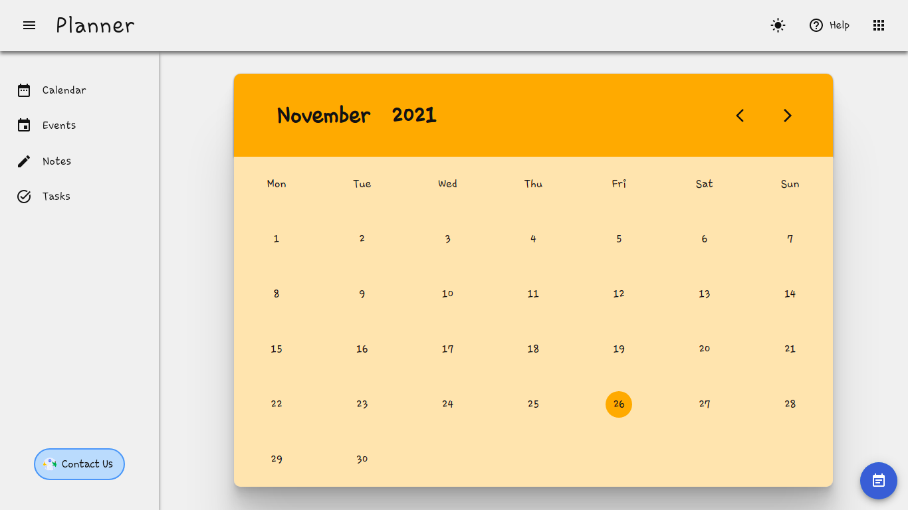
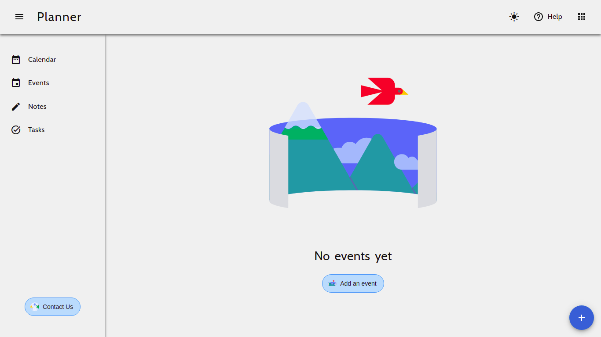
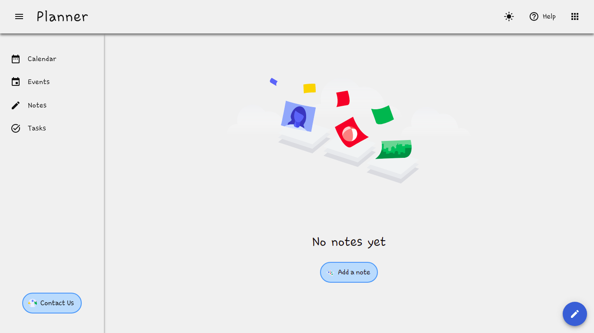
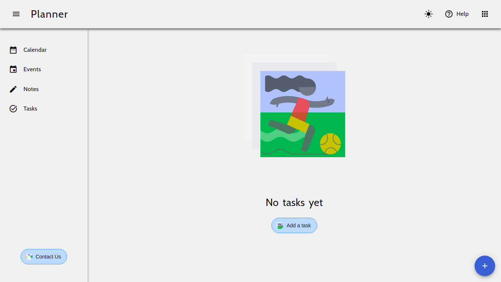
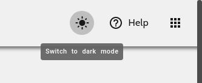

# Planner

<p align="center">

</p>
<p align="center">
Get more done with Planner. 
<br />
Manage, capture and edit your daily events, notes and tasks.
</p>
<p style="margin: 3rem 0 4rem 0;" align="center">

</p>

# Introduction

Planner is a full stack web application built in MERN stack to keep a track of your activity every month, every day, every hour.

-   **Runtime used in backend** - [Node.js](https://nodejs.org/)
-   **Frontend framework** - [React JS](https://reactjs.org/)
-   **CSS preprocessor** - [SASS](https://sass-lang.com/)
-   **Backend framework** - [Express](https://expressjs.com/)
-   **Database** - [MongoDB](https://www.mongodb.com/)

# Navigation

-   **Home Page** - Planner Home page contains links to different pages of the web app.

-   **Calendar** - Planner contains a calendar to view the days of any month of any year, withour any year limit. Unlike other calendars, it works on an algorithm.
<p align="center">

</p>

-   **Events** - In the planner events, you can create, edit and delete an event. For e.g) vreate an event for your best friend's borthday to keep yourself reminded on the big day.
<p align="center">

</p>

-   **Notes** - Use planner notes to record every thought that you want to track. Whether it is an article you saw on internet or a blog you want to save for later or a short poem that you just wrote.
<p align="center">

</p>

-   **Tasks** - Use planner tasks to keep track of your day-to-day activities. Create a task to remind you to buy groceries, prepare for an early test and schedule a meeting with your colleagues.
<p align="center">

</p>

-   **Help** - To get help on Planner, click on the Help button in the header to visit the help section of the planner.

-   **Feedback** - To leave a feedback to the developers, click on the feedback button in the footer of the app. Please be polite in any kind of feedback. Any appreciation of work or a bug report or any other kind of feedback is welcome.

# Themes

Planner's color palette has been synchronized and carefully chosen to provide the best user experince.

The app will switch to dark mode automatically after 8:00 PM and will switch back to light mode at 8:00 AM.

Though the user can still switch between different modes as per their convenience.

To switch between different modes, click on theme icon in the header.

-   **Light Mode**


-   **Dark Mode**



# Development

To clone copy the following command in your terminal and start development.

```sh
git clone https://github.com/akshatmittal61/Planner.git
```

cd into the directory

```sh
cd Planner
```

Install all the dependencies
```sh
npm i
```

Run the project in development mode

```sh
npm run react
```

Run the backend server

```sh
npm run server
```
This will run the server on port [5000](http://localhost:5000) locally with nodemon to continuously watch every change.

If you don't have nodemon on your system, run
```sh
npm i nodemon -g
```

Open [http://localhost:3000](http://localhost:3000) to view it in the browser.

# Author

[Akshat Mittal](https://akshatmittal61.github.io/portfolio)

## Contributors

-   [Akshat Khosya](https://github.com/akshat-khosya)
-   [Sneha Sharma](https://github.com/snehasharma1111)

## References and Libraries Used

-   [Google Keep](https://keep.google.com)
-   [MUI](https://mui.com/)
-   [AOS](https://github.com/michalsnik/aos)
-   [Axios](https://axios-http.com/)
